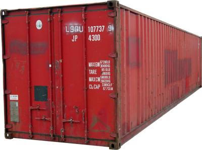

# They are everywhere !1!!

Containers and the intuitive way of working with them are one of the features of Python that can make you productive with the language right from the start.

## All container types are Sequences (iterables)

All containers contain object references and you can put in there whatever you want (also mixing different types).

## Maps

**Two basic :** Sequenzen und Abbildungen - wenn man **list**,
    **tupel** und **dict** kennt, ist man erstmal gut bedient.
Containerklassen sind aber nicht nur auf Userebene zentral,
    sondern sie sind auch ein integraler Bestandteil der internen
    Sprachmechanik
Alles in Python ist ein Objekt und **fast** jedes Objekt hat
    ein dict in dem alle Namen und Funktionen auf die zugehörigen
    Objekte abgebildet sind.
