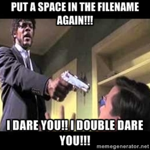

# [CodeCats](http://codecats.io/) updates

## Current assignment alert

Send me your [Pull Requests](https://help.github.com/articles/using-pull-requests/)! just add a link to your Github profile **[in this Markdown file](../codecats-on-github.md)** and see it pop up [here](https://github.com/obestwalter/python-course/pulls) and then see your name added to the [contributors](https://github.com/obestwalter/python-course/graphs/contributors).

## Gitter Chat room

Gitter provides chat rooms which are attached to Github repositories ([features](https://en.wikipedia.org/wiki/Gitter#Features)) - I added one to this repository (see badge on startpage).

# Plan for next session

**More about introspection with lots of [practical exercises](../introspection/exercises.md)**

**... and switch to Python3 ...** sorry - I just can't stand Python2 anymore and you will fare better with Python3 also :D

see: 

* https://wiki.python.org/moin/Python2orPython3
* [Python 3 wall of superpowers](https://python3wos.appspot.com/)

# History

## 1st Session 22 March 2016

### What we did

We made sure that everybody has ...
 
* A Python Interpreter (**[version 2.7](https://www.python.org/download/releases/2.7/)**) installed
* [PyCharm](https://www.jetbrains.com/pycharm/download/) installed.
* Created their [first PyCharm project](https://www.jetbrains.com/help/pycharm/5.0/creating-and-running-your-first-python-project.html)
* Created a new [virtualenv](https://www.jetbrains.com/help/pycharm/5.0/creating-virtual-environment.html) attached attached to that project
* Ran their first ["Hello, world" program](https://github.com/leachim6/hello-world/blob/master/p/python.py)

### What we learned (hopefully ;))

#### Basic tools

* [Markdown](https://guides.github.com/features/mastering-markdown/) (extension .md) for writing formatted text that renders nicely e.g. on Github and can be converted into a lot of different formats.
* [Git](https://git-scm.com/book/en/v2/Getting-Started-About-Version-Control) for Version Control
* [Github](https://github.com/) for collaboration (and accessing these materials)
* [Pull Requests (PRs)](https://help.github.com/articles/using-pull-requests/) for proposing changes

#### Spaces (and other special characters) in filenames are evil

[](http://superuser.com/a/29117/381937)

#### Quick overview about some central tools

See [Tools for exploration](../introspection/README.md#tools-for-exploration)

#### Code block separation by indentation (significant whitespace)

Python is a language where space matters ... meaning  units of code (blocks, function bodies, etc.) are separated by ending a line with a colon (:) and pressing `Enter` - PyCharm already guesses what you want to do then and [indents](http://www.diveintopython.net/getting_to_know_python/indenting_code.html) the new line for you (manually you can indent with the `Tab` key (this also works if you have selected several lines)). The indented code belongs to that block. The block is closed by [outdenting](https://www.jetbrains.com/help/pycharm/5.0/changing-indentation.html?) (with `Shift + Tab`) the first line that should not be part of that block anymore - a.k.a. [significant whitespace](https://www.python.org/dev/peps/pep-0008/#code-lay-out).

Example:

```python
def my_super_function():
    print("I am indented with 4 spaces")
    print("Me too! I belong to the function")
print("I am not inside the function block anymore :(")

for currentElement in range(5):
    print(currentElement)
    print("I also belong to the loop block")
print("I don't belong to the loop block anymore")
```

Here are some articles that throw some light on the debate (yes ... there are people seriously arguing about the best way how to mark code blocks in programming languages).

* [Python: Myths about Indentation](http://www.secnetix.de/olli/Python/block_indentation.hawk)
* [What is Python Whitespace and how does it work?](http://stackoverflow.com/questions/13884499/what-is-python-whitespace-and-how-does-it-work)
* [Python White Space Discussion](http://c2.com/cgi/wiki?PythonWhiteSpaceDiscussion)
#### Everything in Python is an object (even functions and classes)

In this [Python Online Tutor example](http://goo.gl/Yqt7hL) you can see how everything in a running Python program is an object. What you can do with those objects, we will explore next time.

#### Easter eggs

Python has [insider jokes](../internals/easter-eggs.ipynb)!
